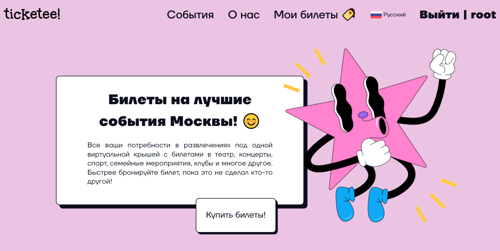

# Курсовая работа | Сундуреев Тамир 211-322
## Сайт для продажи билетов на мероприятия

[Ссылка на макет Figma](https://www.figma.com/file/ZLtLUVy3ozOTxf2FSLCnPD/ticketee?node-id=0%3A1)

## Описание работы
**Курсовая работа** - сайт на тему продажи билетов на мероприятия. Работа реализована с помощью HTML + Jinja, BEM, CSS, JS, SQLite, Django + REST API.

Дизайн и верстка выполнены с нуля. Продумана архитектура сайта и базы данных, определены шаблоны и ключевые модели и связи между ними. Можно переключать языки с русского на английский.

1. Спроектирована база данных с нуля (5 таблиц).
2. Разработка макета для проекта в Figma.
3. Многостраничный сайт с 8 экранами.
4. Сайт представлен на двух языках (djangomodeltranslation).
5. Реализован вход и регистрация в личный кабинет.
6. Реализован CRUD.
7. Реализована административная часть (все таблицы базы данных можно редактировать через админку).
8. Реализована фильтрация.
9. Настроена административная часть Django (различные настройки на странице вывода объектов, на самой странице объекта и т.п.)
10. Проектирование (обзор кейсов использования сайтов, CJM, выбор функционала, проектирование бизнес-процессов и т.д.).

Узнать еще поподробнее можно в прикрепленных pdf-документах репозитория.

## Руководство по запуску готового Django-проекта с GitHub

Это пошаговая инструкция, как запустить готовый Django-проект, опубликованный на GitHub, на своем компьютере.

### 1. Установите необходимые программы

Перед началом убедитесь, что у вас установлены следующие программы:
- **Python (версии 3.8 или новее)**: [Скачать Python](https://www.python.org/downloads/)
- **Git**: [Скачать Git](https://git-scm.com/)
- **pip**: Устанавливается вместе с Python.
- **Virtualenv** (рекомендуется): Установите с помощью команды:
  ```bash
  pip install virtualenv
  ```

---

### 2. Склонируйте проект с GitHub

С помощью Git скачайте проект на ваш компьютер:

```bash
git clone https://github.com/имя-пользователя/имя-репозитория.git
cd имя-репозитория
```

---

### 3. Создайте виртуальное окружение

Создайте виртуальное окружение для изоляции зависимостей проекта:

```bash
python -m venv venv
```

Активируйте виртуальное окружение:
- **Windows**:
  ```bash
  venv\Scripts\activate
  ```
- **macOS/Linux**:
  ```bash
  source venv/bin/activate
  ```

---

### 4. Установите зависимости

Установите все необходимые библиотеки из файла `requirements.txt`:

```bash
pip install -r requirements.txt
```

---

### 5. Настройте переменные окружения

Создайте файл `.env` в корневой директории проекта, если его нет. Заполните его переменными окружения. Пример содержимого `.env`:

```plaintext
DEBUG=True
SECRET_KEY=ваш-секретный-ключ
ALLOWED_HOSTS=127.0.0.1,localhost
DATABASE_URL=ваша-ссылка-на-базу-данных
```

Если проект использует SQLite, переменная `DATABASE_URL` может не потребоваться.

---

### 6. Настройте базу данных

Примените миграции для настройки базы данных:

```bash
python manage.py migrate
```

Если предоставлены фикстуры с начальными данными, загрузите их:

```bash
python manage.py loaddata initial_data.json
```

---

### 7. Соберите статические файлы

Для корректной работы стилей и скриптов выполните команду:

```bash
python manage.py collectstatic --noinput
```

---

### 8. Запустите сервер разработки

Запустите сервер разработки, чтобы увидеть проект в работе:

```bash
python manage.py runserver
```

Теперь проект будет доступен по адресу: [http://127.0.0.1:8000](http://127.0.0.1:8000).

---

## Дополнительные шаги

### Создание суперпользователя для доступа к админ-панели

Если вам нужен доступ к административной панели, создайте суперпользователя:

```bash
python manage.py createsuperuser
```

Введите имя пользователя, адрес электронной почты и пароль.

Админ-панель будет доступна по адресу: [http://127.0.0.1:8000/admin](http://127.0.0.1:8000/admin).